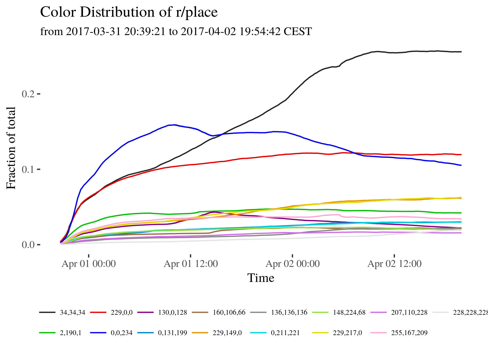

# Analyse r/place
Some code to analyse r/place


## bitmap file

Get the bitmap file every 10 seconds

```shell
while test 1 ; do wget https://www.reddit.com/api/place/board-bitmap ; sleep 10 ; done
```
## convert to png

Can be done with [this](https://github.com/trosh/rplace/blob/master/rplacelapse.py) code.

## convert to mp4

```shell
ffmpeg -framerate 128 -i board-bitmap.%d.png -c:v libx264 -crf 21 place.mp4
```
change framerate at will

## crop mp4
if you are only interested in a part of the bitmap, you can crop `place.mp4` as follows
```shell
ffmpeg -i in.mp4 -filter:v "crop=out_w:out_h:x:y" out.mp4
```
Options:
* out_w: the width of the output rectangle
* out_h: the height of the output rectangle
* x and y: the top left corner of the output rectangle


## color distribution

use `colorDistr.R`


without white and line plot

